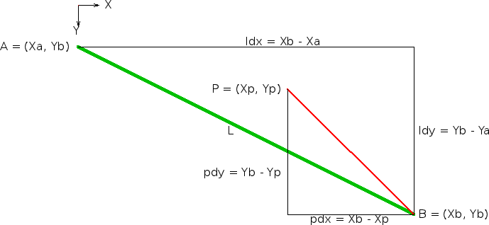

Map Geometry
============

This document describes the geometry of the Widelands map, how it is represented and displayed. First have a look at this image.

.. image:: images/geometry/map.png

It shows that the map is composed of triangles. It is useful to see the map as a graph, especially when making searches on it. `Graph theory`_ uses the terms vertex (or node) and edge (or arc). A vertex is a corner of a polygon, so in this case a vertex is a corner of a triangle. Each vertex has 6 neighbouring triangles and each triangle has 3 neighbouring vertices. This implies that there are 2 triangles for each vertex. Each vertex has 6 neighbouring edges and each edge has 2 neighbouring vertices. This implies that there are 3 edges for each vertex. The map wraps around in both dimensions, so it forms a torus_. Eventhough a torus is a 3-dimensional shape, the fact that the map is a torus does not make it 3-dimensional. The torus itself can never be seen, and all edges are equally long. On a real torus, the edges on the outside would be longer than those on the inside. But the map has some visible 3-dimensional properties; vertices have a property called height. This can be seen in the image above.

.. _Graph theory: http://en.wikipedia.org/wiki/Graph_theory
.. _torus: http://en.wikipedia.org/wiki/Torus

Representation
--------------
The map is basically an array of vertices. A vertex is a record consisting basically of a number representing the height property and a 2 triangles called *r* (right) and *d* (down). Which those triangles are is seen in this image:

A vertex is also responsible for storing 3 edges, but edges do not yet have any properties to store. If they had, each vertex would be responsible for storing the 3 edges shown in this image:

Display
-------
The map is displayed in parallell perspective. But the view is not from straight above (zenith). A triangle has the measures as shown in this image:

But the projection of the triangle has the following measures:

.. image:: images/geometry/triangle-projection-measures.png

These measures are then multiplied with the constant *64 pixel*. To find out the angle that the map is seen from, we have to construct this figure:

From the figure we get that the line of sight is at an angle of :math:`arccos(1/\sqrt{3})` from zenith or :math:`arcsin(1/\sqrt{3})` from the ground.

Not seeing the map from the zenith makes it possible to visualize the height of a vertex by moving it upwards on the screen (decreasing the screen y coordinate). Heights are always positive, so the y-coordinate is never incremented. This makes things simpler (see below about interpreting mouse positions). This does not mean that for example depth under sealevel cannot be represented. This can be achieved by setting the sealevel to a positive value. Here is an example where the moved-up edges can be seen in blue and the underlying grid in white:

.. image:: images/geometry/height-affecting-y-coordinate.png

But that is not enough to make the map look 3-dimensional. Something called gourad shading is also needed, which works as follows. The normal of each triangle is calculated by taking the cross product of two vectors representing edges of the triangle and normalizing it. Then the normal of each vertex is calculated by taking the sum of the normal of each neighbouring triangle and normalizing that sum. For each vertex a brightness value is calculated based on the dot product of the vertex normal and a vector representing the direction of the sunshine. This is basically a model of the fact that surfaces facing the sun are brighter than surfaces that do not face the sun. When a triangle is rendered, each pixel's brightness is interpolated based on the brightnesses of the vertices surrounding the triangle.

To display something on a triangle, it is necessary to get the screen coordinates of it. The screen coordinates of the 3 vertices surrounding the triangle are available; :math:`(X_1, Y_1)`, :math:`(X_2, Y_2)`, :math:`(X_3, Y_3)`. But which coordinates does the middle of the triangle have? To answer that one first has to define what is meant with the middle of the triangle. It is smart to chose a definition that gives an easy answer, like this one; the middle :math:`(X_m, Y_m)` is the one that makes the sum of the squared distances from each surrounding vertex to the midpoint as small as possible. This is known as the least square solution. The sum of the squared distances is :math:`\sum\limits_{i=1}^3 (X_m - X_i)^2 + (Y_m - Y_i)^2`. Solving for the coordinate pair :math:`(X_m, Y_m)` that minimizes the sum gives :math:`(X_m, Y_m) = (\frac{X_1+X_2+X_3}{3},\frac{Y_1+Y_2+Y_3}{3})`.

An important thing to do when displaying the map is to interpret commands that the user gives with the mouse on the map. To do this one has to determine what the mouse cursor is pointing at. For any point represented by pair of screen coordinates, it has to be determined which triangle it is in or which vertex it is closest to. The 3-dimensional visualization makes this difficult because the y-coordinates are moved. But it is not nearly as difficult as if both x- and y-coordinates had been affected. (Something that makes it complicated is wrapping.) See this image:

.. image:: images/geometry/grid-with-vertical-lines.png

One can at least easily determine which pair of (neighbouring) red lines that the point lies between. The search is narrowed down further by determining which pair of white horizontal lines (underlying grid) that the point lies between. But this will not give the definitive pair of map y-cooridnates that the point is between. Because heights can only be positive, one only has to look downwards (higher map y-coordinate). This is done with a loop. There are 2 cases. One where the node in the left column has greater map y-coordinate than the right node. This is called slash because the edge between them goes in the direction of the '/' character. In the other case, the edge goes in the direction of the '\\' character. After this we have a pair of map y-coordinates that the point is between. See this image (which shows the slash case):

We are now limited by the horizontal green lines. Together with the vertical red lines, this gives the rectangle where the point is. As seen in the image, it can be in one of 4 triangles. To find out in which of them the point is, one can first test if the point is above the upper blue line. Then the point is in the upper triangle. Else test if the point is above the second blue line. Then it is in the second triangle. Else test if the point is above the third blue line. Then it is in the third triangle. Else it is in the lowest triangle.

How can one know if a point is above a line? Suppose that we have a line *L* from the point :math:`A = (X_a, Y_a)` to the point :math:`B = (X_b, Y_b)` and the point :math:`P = (X_p, Y_p)`, where :math:`X_a \leq X_p < X_b`. See this image:

Suppose there is a line *PB* from *P* to *B*. Then *P* is above *L* if the slope of *PB* is greater than the slope of *L*:

.. math:: pdy / pdx > ldy / ldx

This may seem strange, but that is only because the y-axis goes in the opposite direction of what one is used to from mathematics. Because *pdx* and *ldx* are both always positive, the condition can be rewritten to:

.. math:: pdy * ldx > ldy * pdx;

(Here *ldx* is a constant known at compile time with the value 64, which is a power of 2. Therefore the compiler will make the multiplication as a bit shift, which is much faster than normal multiplication. Not that it matters in this case.)

Now one can determine which triangle the point is in. To determine which vertex it is closest to, just calculate the distance to each vertex *i*, :math:`\sqrt{(X_i - X_p)^2 + (Y_i - Y_p)^2}`, and see which is smallest. (Of course it is not necessary to actually calculate the square roots.)

Regions
-------
A region can be defined as everything within a certain distance from a certain point.

Vertex regions
^^^^^^^^^^^^^^
A vertex region is the set of vertices that can be reached from the starting vertex by moving along at most N edges.

Triangle regions
^^^^^^^^^^^^^^^^
A triangle region is the set of triangles that can be reached from the starting triangle by crossing at most N edges. This picture illustrates what it might look like for d triangles:

and for r triangles:

