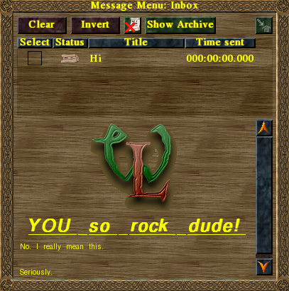

The Widelands Rich Text System
==============================

All texts that can be displayed to the user can be formatted to be layouted
and nicely formatted. This allows for changing of font sizes, weights, colors
and for the embedding of images. This documents how to format a string to be
recognized as rich text and which attributes are understood.

The Widelands rich text language is inspired by HTML and therefore uses a
syntax very similar to it. A rich text is started with ``<rt>`` and ended with
``</rt>``. A rich text can have an image associated with it, this image is
then displayed next to the text.

Inside the rich text, each paragraph is enclosed by ``
`` and ``
``. You
give font attributes to this tag to change the appearance of the text
displayed inside.

Reference
---------

``<rt>``
^^^^^^^^

Starts or ends a rich text. Must be the first tag to appear in the string.
A full example would be::

   <rt image=map:khanktrukh.png>
Hello World
</rt>

This would instruct widelands to use the image of Khankruth that comes with
the map, left align it. To the right of it there would be two lines of text.
The first line being ``Hello`` and the second being ``World``. They would be
displayed with a font-size of 12 points and a line-spacing of 3 points.

Valid attributes for ``<rt>`` are:

image
   The name of a image to use, can be prefixed with ``map:`` which instructs
   widelands to load the image from the ``pics/`` directory inside the map of
   this scenario.

image-align
   ``right``, ``center`` or ``left``. Defines were the image is displayed.

text-align
   ``right``, ``center`` or ``left``. Defines were the text is displayed.

``
``
^^^^^^^^

A text paragraph inside a rich text. This gives control over which font is
used for rendering and how it should be formatted.

Valid attributes for ``
`` are:

font-size
   The font size to use in points. 10 points is the default. Use 12 points for
   mission texts.

font-face
   Font face style of the font to use. The valid fonts are ``sans``, ``serif``,
   and ``condensed``.

font-color
   The color of this font as a RGB hex tuple. That means 000000 is completely
   black while ff0000 is completely red. Default color is a bright yellow
   (ffff00).

font-weight
   ``normal`` or ``bold``. Note that not everything is supported by all fonts.
   Do not use with ``font-style=italic`` at the same time; double formatting is
   typographically bad.

font-style
   ``normal`` or ``italic``. Note that not everything is supported by all fonts.
   Do not use with ``font-weight=bold`` at the same time; double formatting is
   typographically bad.

font-decoration
   ``normal`` or ``underline``. Note that not everything is supported by all fonts.
   Do not use with ``font-weight=bold`` or ``font-style=italic`` at the same time;
   double formatting is typographically bad.

line-spacing
   Line spacing in points. Default is 0.

`` ``
^^^^^^^^

This inserts a line break into the text. The line break character (``\n``) is
ignored inside a rich text.

Real world Lua example
----------------------

Here is a small example of a fancy message send to the user via the
:meth:`wl.game.Player.send_message` method:

.. code-block:: lua

   wl.Game().players[1]:send_message(
      "Hi",
      "<rt image=images/logos/wl-ico-128.png image-align=center></rt>" ..
      "<rt text-align=center>" ..
      "
" ..
         "YOU so rock dude!" ..
      "
</rt>" ..
      "<rt>
No. I really mean this.  Seriously.
</rt>",
      { popup = true }
   )

The title of the message mustn't be a rich text, the body (which is just one
string, it has been separated for easier reading and concatenated Lua-style
via the ``..`` operator) is one: the first rich text includes a centered image
and no text. The second is the text ``YOU so rock dude!`` in italic, bold and
underlined. Then a simple text follows in four lines -- two of them being
empty. The message popups the message window when it is received.

The complete message rendered looks like this on my system:

