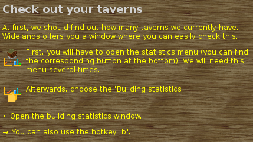

.. _wlrichtext:

The Widelands Rich Text System
==============================

All texts that can be displayed to the user can be marked up to be laid out
and nicely formatted. This allows for changing of font sizes, weights, colors
and for the embedding of images. This documents how to format a string to be
recognized as rich text and which attributes are understood.

The Widelands rich text language is inspired by HTML and therefore uses a
syntax very similar to it. To tell our rendering system to go into richtext mode,
start your text with ``<rt>`` and end it with ``</rt>``.

.. toctree::
   :maxdepth: 2

   General Markup Functions <autogen_auxiliary_richtext.rst>
   Scenario Markup Functions <autogen_auxiliary_richtext_scenarios.rst>
   Richtext Tags, their Attributes and Restrictions <autogen_rt_tags.rst>

Code Example
------------

Here is a simplified version of a fancy message displayed to the user:

.. code-block:: lua

   body =
      "<rt>                                     -- This is richtext
         
                                    -- Start a paragraph
              -- Set font size and color
               Big font to create a header
            
         

         

            
               Normal paragraph, just with a bit more text to show how it looks like.
            
         

         -- The following content should be spread across a full line
         

            

               

                  
                  
                  
               

            

            
                       -- Fill up the remaining space
               

                  
                     Another normal paragraph
                  
               

            

         

         ...
      </rt>"

This is quite a lot of hacking, so we have :ref:`Lua convenience functions <richtext.lua>`
set up. We recommend that you always use those while scripting in Lua, which will
also give us consistency in style throughout Widelands.
Using the convenience functions will also result in cleaner code when
including translation markup (the ``_[[Some text]]`` or ``_"Some text"`` function).
We can now create complicated markup fairly easily, like this:

.. code-block:: lua

   include "scripting/richtext.lua"

   body = h1(_[[Normal header]]) ..
          h1("ff0000", _[[Colored header]]) ..
          p(_[[Normal paragraph, just with a bit more text to show how it looks like.]]) ..
          p("align=center", _[[A centered paragraph]]) ..
          li_image("images/wui/menus/menu_toggle_menu.png", _[[An image with right aligned text. This is just text to show automatic line breaks and behavior in regard with images]]) ..
          li(_[[A list item]]) ..
          li(font("color=ff0000 bold=1", _[[Red and bold]])) ..
          li_arrow(_[[A list item with an arrow]]) ..
          p(_[[A more complicated paragraph with ]] ..
             font("color=ff0000", _[[red text ]]) ..
             _[[and ]] ..
             font("italic=1 bold=1", _[[bold italic formatted text.]])
           ),

This results in the following for a campaign message box:

:ref:`Return to index<richtext.lua>`
