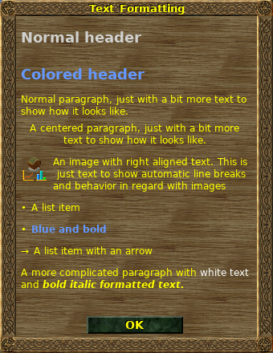

.. _wlrichtext:

The Widelands Rich Text System
==============================

All texts that can be displayed to the user can be marked up to be layouted
and nicely formatted. This allows for changing of font sizes, weights, colors
and for the embedding of images. This documents how to format a string to be
recognized as rich text and which attributes are understood.

The Widelands rich text language is inspired by HTML and therefore uses a
syntax very similar to it. To tell our rendering system to go into richtext mode,
start your text with ``<rt>`` and end it with ``</rt>``.

.. toctree::
   :maxdepth: 2

   General Markup Functions <autogen_auxiliary_richtext.rst>
   Scenario Markup Functions <autogen_auxiliary_richtext_scenarios.rst>
   Richtext Tags, their Attributes and Restrictions <autogen_rt_tags.rst>

Code Example
------------

Here is a simplified version of a fancy message displayed to the user:

.. code-block:: lua

   message_body =
      "<rt>                                     -- This is richtext
         
                                    -- Start a paragraph
              -- Set font size and color
               Check out your taverns
            
         

         

            
               At first, we should find out how many taverns we currently have.
               Widelands offers you a window where you can easily check this.
            
         

         -- The following content should be spread across a full line
         

            

               

                  
                  
                  
               

            

            
                       -- Fill up the remaining space
               

                  
                     First, you will have to open the statistics menu (you can
                     find the corresponding button at the bottom).
                     We will need this menu several times.
                  
               

            

         

         ...
      </rt>"

This is quite a lot of hacking, so we have convenience functions set up -- we
recommend that you always use those, which will also give us consistency in
style throughout Widelands. So, coding the message will become much easier,
and it's also more convenient for including translation markup (the ``_[[Some text]]`` function).
The complete message now looks like this:

.. code-block:: lua

   include "scripting/richtext.lua"

   h1(_[[Check out your taverns]]) ..
   p(_[[At first, we should find out how many taverns we currently have. Widelands offers you a window where you can easily check this.]]) ..
   li_image("images/wui/menus/menu_toggle_menu.png", _[[First, you will have to open the statistics menu (you can find the corresponding button at the bottom). We will need this menu several times.]]) ..
   li_image("images/wui/menus/menu_building_stats.png", _[[Afterwards, choose the ‘Building statistics’.]]) ..
   li(_[[Open the building statistics window.]]) ..
   li_arrow(_[[You can also use the hotkey ‘b’.]])

And this is what the rendered result looks like:

